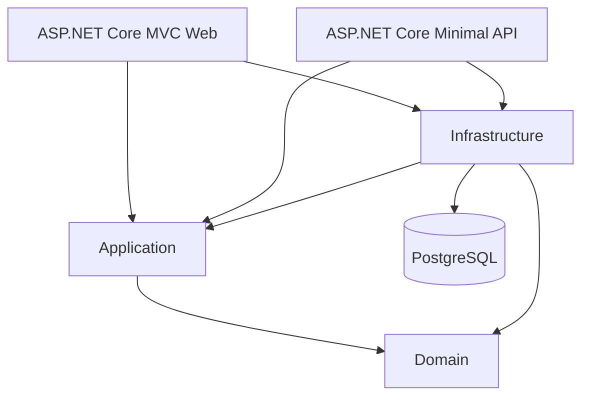

# Arquitectura general

## Vista general

La solución está organizada en capas con proyectos separados. `Domain`
contiene el modelo y sus invariantes; `Application` coordina los casos de uso;
`Infrastructure` implementa persistencia; `Web` expone la interfaz MVC; y
`Api` expone endpoints REST.



La solución también contiene cuatro proyectos de pruebas:

- `Licitaciones.UnitTests`.
- `Licitaciones.FunctionalTests`.
- `Licitaciones.IntegrationTests`.
- `Licitaciones.EndToEndTests`.

## Responsabilidad de cada capa

### Domain

Contiene las entidades:

- `Licitacion`;
- `Proveedor`;
- `Oferta`;
- `NivelAprobacion`;
- `TipoCambio`.

También contiene el estado de las licitaciones, invariantes, validaciones,
transiciones de estado y excepciones propias del dominio. La capa no depende
de Application, Infrastructure, Web ni Api.

### Application

Contiene los casos de uso y servicios para crear, consultar, editar, eliminar,
publicar, evaluar y convertir información. Define contratos de repositorio,
resultados, DTOs y excepciones de aplicación. Por ejemplo, `OfertaService`
coordina la validación de licitaciones, proveedores, montos, duplicados, mejor
oferta y operaciones de ofertas.

### Infrastructure

Contiene:

- `LicitacionesDbContext`;
- configuraciones EF Core;
- repositorios;
- migraciones;
- configuración de PostgreSQL;
- restricciones, índices, claves foráneas y control de concurrencia `xmin`.

La persistencia se implementa con Entity Framework Core y PostgreSQL.

### Web

Es una aplicación ASP.NET Core MVC. Contiene controladores, ViewModels,
vistas Razor, validación antiforgery, navegación y presentación de errores
esperables. Las fechas visibles se convierten a `America/Costa_Rica`, mientras
las fechas internas permanecen en UTC.

### Api

Es una aplicación ASP.NET Core Minimal API. Contiene endpoints REST para los
módulos, contratos de solicitud y respuesta, OpenAPI, respuestas Problem
Details, manejo global de excepciones y `GET /health`.

## Dependencias de proyectos

Las referencias reales entre proyectos son:

- `Application` → `Domain`.
- `Infrastructure` → `Application` + `Domain`.
- `Web` → `Application` + `Infrastructure`.
- `Api` → `Application` + `Infrastructure`.

No se documentan dependencias adicionales entre proyectos.

## Flujo de una operación

El flujo normal de una operación expuesta por Web o API es:

```text
Web o API
  → servicio de Application
  → contrato de repositorio
  → repositorio de Infrastructure
  → EF Core
  → PostgreSQL
  → resultado o error controlado
  → respuesta Web o API
```

Las reglas de negocio se ejecutan en Domain y Application antes de persistir.
Las restricciones de base de datos complementan esas validaciones para
unicidad, integridad referencial, montos y concurrencia.

## Arquitectura de pruebas

### UnitTests

Prueban entidades Domain y servicios Application de forma aislada, usando
implementaciones en memoria cuando es necesario.

### FunctionalTests

Prueban servicios y endpoints mediante hosts de prueba, `WebApplicationFactory`,
repositorios falsos y solicitudes HTTP. Verifican contratos API, formularios
MVC, validaciones, redirecciones y errores controlados.

### IntegrationTests

Prueban Infrastructure y los recorridos API/Web con PostgreSQL real mediante
Testcontainers. Incluyen configuraciones EF, repositorios, migraciones,
claves, índices y concurrencia.

### EndToEndTests

Prueban el recorrido Web mediante navegador con Playwright. La infraestructura
E2E levanta PostgreSQL con Testcontainers y una aplicación Web sobre Kestrel.

## Infraestructura de ejecución

Docker Compose define API, Web y PostgreSQL. Kubernetes define los recursos de
API, Web y PostgreSQL, incluyendo Deployments, Services, ConfigMap, Secret de
ejemplo, StatefulSet, PVC y probes. GitHub Actions restaura, compila y ejecuta
la solución, además de preparar Chromium para las pruebas E2E.
