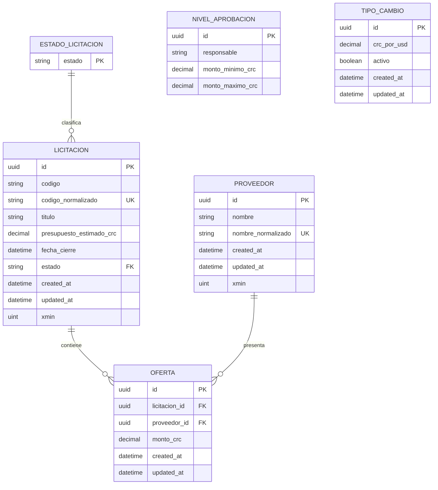

# Modelo de datos

## Entidades

### Licitacion

| Campo | Tipo lógico | Persistencia y restricciones |
|---|---|---|
| `Id` | `Guid` | Clave primaria; valor generado por el dominio. |
| `Codigo` | `string` | Obligatorio; máximo 100 caracteres. |
| `CodigoNormalizado` | `string` | Obligatorio; índice único. |
| `Titulo` | `string` | Obligatorio; máximo 200 caracteres. |
| `PresupuestoEstimadoCrc` | `decimal` | Obligatorio; `numeric(18,2)`; mayor que cero. |
| `FechaCierre` | `DateTimeOffset` | Obligatoria; `timestamp with time zone`. |
| `Estado` | `EstadoLicitacion` | Obligatorio; se almacena como texto y referencia el catálogo de estados. |
| `CreatedAt` | `DateTimeOffset` | Obligatorio; `timestamp with time zone`; UTC. |
| `UpdatedAt` | `DateTimeOffset` | Obligatorio; `timestamp with time zone`; UTC. |
| `Version` | `uint` | Columna `xmin`; token de concurrencia. |

La entidad inicia en `Borrador`. La publicación válida cambia el estado a
`Publicada`.

### Proveedor

| Campo | Tipo lógico | Persistencia y restricciones |
|---|---|---|
| `Id` | `Guid` | Clave primaria; valor generado por el dominio. |
| `Nombre` | `string` | Obligatorio. |
| `NombreNormalizado` | `string` | Obligatorio; índice único. |
| `CreatedAt` | `DateTimeOffset` | Obligatorio; `timestamp with time zone`; UTC. |
| `UpdatedAt` | `DateTimeOffset` | Obligatorio; `timestamp with time zone`; UTC. |
| `Version` | `uint` | Columna `xmin`; token de concurrencia. |

### Oferta

| Campo | Tipo lógico | Persistencia y restricciones |
|---|---|---|
| `Id` | `Guid` | Clave primaria; valor generado por el dominio. |
| `LicitacionId` | `Guid` | Obligatorio; clave foránea hacia `licitaciones`. |
| `ProveedorId` | `Guid` | Obligatorio; clave foránea hacia `proveedores`. |
| `MontoCrc` | `decimal` | Obligatorio; `numeric(18,2)`; mayor que cero. |
| `CreatedAt` | `DateTimeOffset` | Obligatorio; `timestamp with time zone`; UTC. |
| `UpdatedAt` | `DateTimeOffset` | Obligatorio; `timestamp with time zone`; UTC. |

No existe una propiedad `Version` configurada para `Oferta`.

### NivelAprobacion

| Campo | Tipo lógico | Persistencia y restricciones |
|---|---|---|
| `Id` | `Guid` | Clave primaria; valor generado por el dominio. |
| `Responsable` | `string` | Obligatorio; máximo 150 caracteres en EF Core. |
| `MontoMinimoCrc` | `decimal` | `numeric(18,2)`; debe ser positivo. |
| `MontoMaximoCrc` | `decimal?` | `numeric(18,2)`; opcional y no menor que el mínimo. |

No contiene campos de auditoría ni una relación persistida con licitaciones u
ofertas.

### TipoCambio

| Campo | Tipo lógico | Persistencia y restricciones |
|---|---|---|
| `Id` | `Guid` | Clave primaria; valor generado por el dominio. |
| `CrcPorUsd` | `decimal` | Obligatorio; `numeric(18,2)`; mayor que cero. |
| `Activo` | `bool` | Obligatorio; índice único filtrado para valores verdaderos. |
| `CreatedAt` | `DateTimeOffset` | Obligatorio; `timestamp with time zone`; UTC. |
| `UpdatedAt` | `DateTimeOffset` | Obligatorio; `timestamp with time zone`; UTC. |

No contiene relación persistida con licitaciones, proveedores u ofertas.

## Relaciones

Las relaciones configuradas en EF Core son:

- Una `Licitacion` puede tener muchas `Oferta`.
- Un `Proveedor` puede tener muchas `Oferta`.
- Cada `Oferta` pertenece a una `Licitacion` mediante `LicitacionId`.
- Cada `Oferta` pertenece a un `Proveedor` mediante `ProveedorId`.
- La relación de la clave foránea está configurada con `DeleteBehavior.Cascade`
  a nivel de persistencia, por lo que PostgreSQL/EF Core define ese
  comportamiento para la relación. Sin embargo, el caso de uso de eliminación
  aplica una regla previa y bloquea la eliminación de una licitación que tiene
  ofertas asociadas.
- La eliminación de un proveedor con ofertas está restringida mediante `Restrict`.
- `Licitacion.Estado` referencia el catálogo persistido de estados de
  licitación con eliminación restringida.
- `NivelAprobacion` y `TipoCambio` no tienen relaciones persistidas con las
  demás entidades.

## Restricciones verificables

- `ux_licitaciones_codigo_normalizado`: código de licitación único.
- `ux_proveedores_nombre_normalizado`: proveedor normalizado único.
- `ux_ofertas_licitacion_proveedor`: una oferta por licitación y proveedor.
- `ux_tipos_cambio_activo`: un único tipo de cambio con `Activo = true`.
- `ck_licitaciones_presupuesto_positivo`: presupuesto mayor que cero.
- `ck_ofertas_monto_positivo`: monto de oferta mayor que cero.
- `ck_tipos_cambio_crc_positivo`: valor CRC por USD mayor que cero.
- Precisión `numeric(18,2)` para presupuestos, montos de ofertas, rangos de
  aprobación y tipos de cambio.
- Claves foráneas de ofertas hacia licitaciones y proveedores.
- Clave foránea de estado de licitación hacia su catálogo.
- `xmin` como token de concurrencia en licitaciones y proveedores.
- Auditoría `CreatedAt` y `UpdatedAt` en UTC para las entidades que poseen esos
  campos.
- Las validaciones de rango de `NivelAprobacion` y la ausencia de traslapes se
  aplican en el servicio de aplicación.

## Migraciones

| Migración | Cambio |
|---|---|
| `20260824003850_CrearProveedores` | Crea `proveedores`, su clave primaria, auditoría, `xmin` e índice único del nombre normalizado. |
| `20260824164851_CrearLicitaciones` | Crea el catálogo de estados, `licitaciones`, presupuesto, fecha, auditoría, estado, `xmin`, restricción positiva, clave foránea e índice único del código normalizado. |
| `20260824203636_CrearOfertas` | Crea `ofertas`, monto, auditoría, claves foráneas, restricción positiva e índice único licitación-proveedor. |
| `20260824211656_CrearNivelesAprobacion` | Crea `niveles_aprobacion` con responsable y rangos monetarios. |
| `20260824214000_CrearTiposCambio` | Crea `tipos_cambio`, restricción positiva e índice único filtrado para el registro activo. |
| `LicitacionesDbContextModelSnapshot` | Mantiene el snapshot del modelo EF Core actual. |

## Diagrama entidad-relación

`NIVEL_APROBACION` y `TIPO_CAMBIO` aparecen sin conexión a otras entidades
porque el modelo real no define una relación persistida para ellas.
